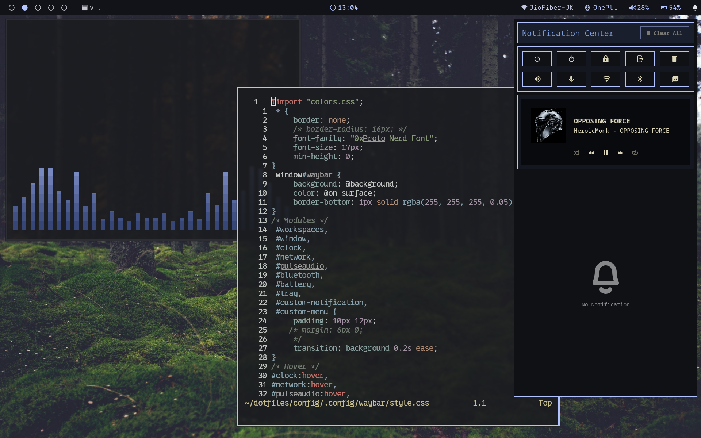
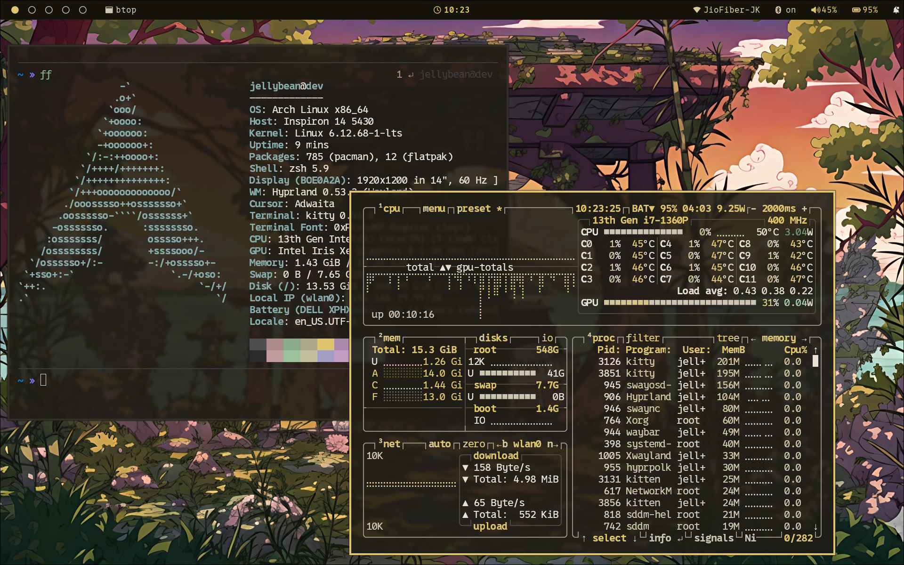
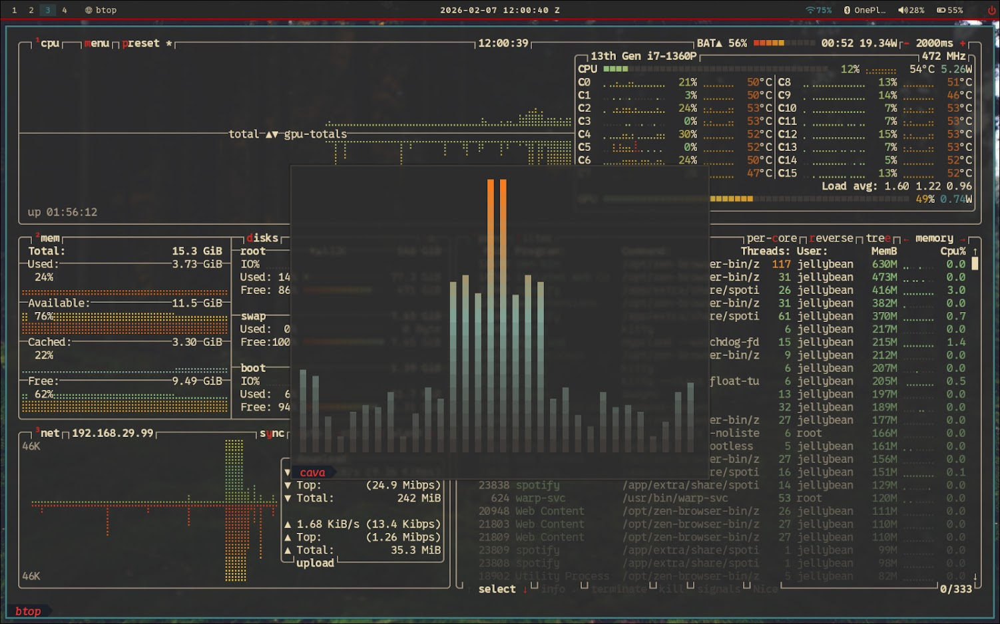
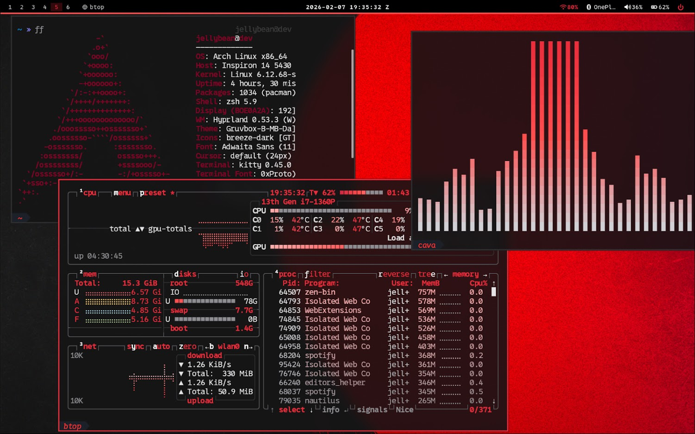

# Graymagic

`Graymagic` is a development/staging repo for a Hyprland desktop for Hackers to be productive and efficient.

At the moment, this repository mainly serves as a visual preview space for the theme direction and its color moods. The screenshots below show the current variants that define the project style.

## Theme Direction

- Hyprland-focused desktop styling
- Minimal, muted base palette
- Accent-driven variants for different moods
- Early-stage repo intended for iteration and previewing

## Screenshot Gallery

### Calm Blue

### Sunset Orange

### Forest

### ImperialRed

## Status

This repo is still in an early dev state. Expect the structure, naming, and automation around the setup to evolve as the project is cleaned up and expanded.
